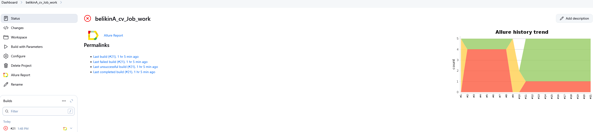
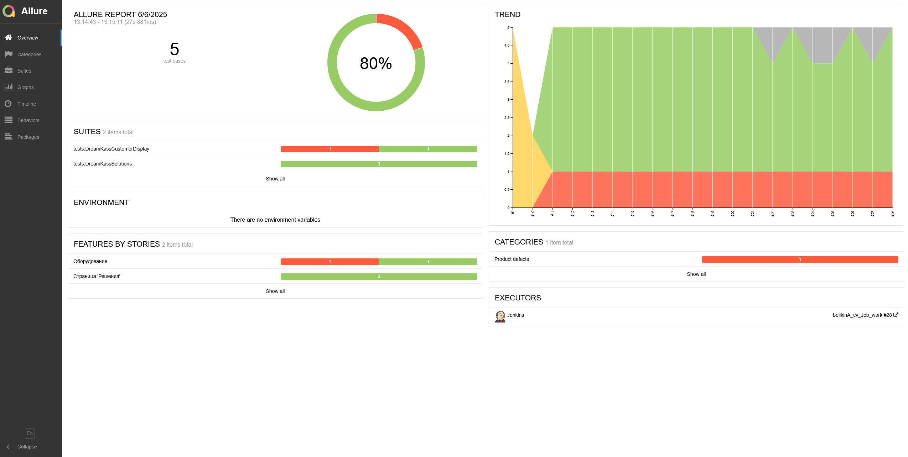
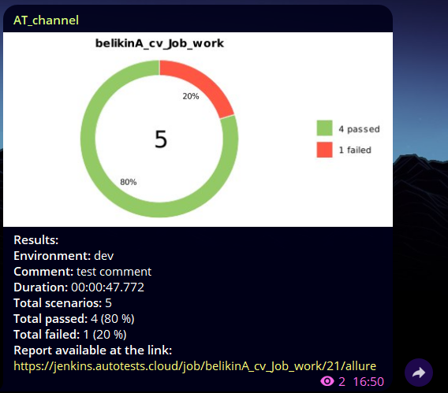


# Проект по автоматизации тестирования для компании [DreamKas](https://dreamkas.ru/)

> Дримкас — это экосистема для малого бизнеса. Мы делаем кассы и онлайн-сервисы, которые помогают сохранять и увеличивать прибыль торговой точки. Нашими продуктами ежедневно пользуются сотни тысяч предпринимателей по всей стране. В первую очередь, мы думаем о наших клиентах, поэтому ищем самых сильных, креативных и смелых коллег.
## **Содержание:**
____

* <a href="#tools">Технологии и инструменты</a>

* <a href="#cases">Примеры автоматизированных тест-кейсов</a>

* <a href="#jenkins">Сборка в Jenkins</a>

* <a href="#console">Запуск из терминала</a>

* <a href="#allure">Allure отчет</a>

* <a href="#telegram">Уведомление в Telegram при помощи бота</a>

* <a href="#video">Примеры видео выполнения тестов на Selenoid</a>
____
<a id="tools"></a>
## <a name="Технологии и инструменты">**Технологии и инструменты:**</a>

## 💻 Технологический стек

<div align="center">
  <table>
    <tr>
      <!-- Первая строка -->
      <td align="center" width="110">
        <a href="https://www.jetbrains.com/idea/" target="_blank">
          
        </a>
        <br>IDEA
      </td>
      <td align="center" width="110">
        <a href="https://www.java.com" target="_blank">
          
        </a>
        <br>Java
      </td>
      <td align="center" width="110">
        <a href="https://junit.org/junit5/" target="_blank">
          
        </a>
        <br>JUnit 5
      </td>
      <td align="center" width="110">
        <a href="https://gradle.org/" target="_blank">
          
        </a>
        <br>Gradle
      </td>
      <td align="center" width="110">
        <a href="https://selenide.org/" target="_blank">
          
        </a>
        <br>Selenide
      </td>
    </tr>
    <tr>
      <!-- Вторая строка -->
      <td align="center" width="110">
        <a href="https://aerokube.com/selenoid/" target="_blank">
          
        </a>
        <br>Selenoid
      </td>
      <td align="center" width="110">
        <a href="https://docs.qameta.io/allure/" target="_blank">
          
        </a>
        <br>Allure
      </td>
      <td align="center" width="110">
        <a href="https://www.jenkins.io/" target="_blank">
          
        </a>
        <br>Jenkins
      </td>
      <td align="center" width="110">
        <a href="https://github.com/" target="_blank">
          
        </a>
        <br>GitHub
      </td>
    </tr>
  </table>
</div>

<p align="center">  
<a href="https://www.jetbrains.com/idea/"></a>  
<a href="https://www.java.com/"></a>  
<a href="https://github.com/"></a>  
<a href="https://junit.org/junit5/"></a>  
<a href="https://gradle.org/"></a>  
<a href="https://selenide.org/"></a>  
<a href="https://aerokube.com/selenoid/"></a>  
<a href="ht[images](images)tps://github.com/allure-framework/allure2"></a> 
<a href="https://qameta.io/"></a>   
<a href="https://www.jenkins.io/"></a>  
<a href="https://www.atlassian.com/ru/software/jira/"></a>  
</p>

____
<a id="cases"></a>
## <a name="Примеры автоматизированных тест-кейсов">**Примеры автоматизированных тест-кейсов:**</a>
____
- ✓ *Добавление товара в корзину*
- ✓ *Проверка соответствия описания товара*
- ✓ *Проверка того, что сервисы ведут на корректную страницу*
- ✓ *Проверка цен на сервисы*
- ✓ *Проверка названия модели в попапе обратной свзяи*


____
<a id="jenkins"></a>
## </a><a name="Сборка"></a>Сборка в [Jenkins](https://jenkins.autotests.cloud/job/belikinA_cv_Job_work/)</a>
____
<p align="center">  
<a href="https://jenkins.autotests.cloud/job/belikinA_cv_Job_work"></a>  
</p>


### **Параметры сборки в Jenkins:**

- *browser (браузер, по умолчанию chrome)*
- *browserVersion (версия браузера, по умолчанию 127.0)*
- *browserSize (размер окна браузера, по умолчанию 1920x1080)*
- *baseUrl (адрес тестируемого веб-сайта)*
- *remoteUrl (логин, пароль и адрес удаленного сервера Selenoid)*

<a id="console"></a>
## Команды для запуска из терминала
___
***Локальный запуск:***
```bash  
gradle clean test 
```

***Удалённый запуск через Jenkins:***
```bash  
-Dselenoid.url=${SELENOID_URL}  
-Dselenoid.login=${SELENOID_LOGIN}  
-Dselenoid.password=${SELENOID_PASSWORD}  
-Dbrowser=${BROWSER} -Dbrowser.version=${BROWSER_VERSION}  
-Dbrowser.size=${BROWSER_SIZE} clean ${TASK}
```
___
<a id="allure"></a>
## </a> <a name="Allure"></a>Allure [отчет](https://jenkins.autotests.cloud/job/belikinA_cv_Job_work/28/allure/)</a>
___

### *Главная страница Allure-отчета*

<p align="center">  
  
</p>  


##  Уведомления в Telegram

### После завершения сборки, бот, созданный в Telegram, автоматически обрабатывает и отправляет сообщение с результатом

<p align="center">

</p>
